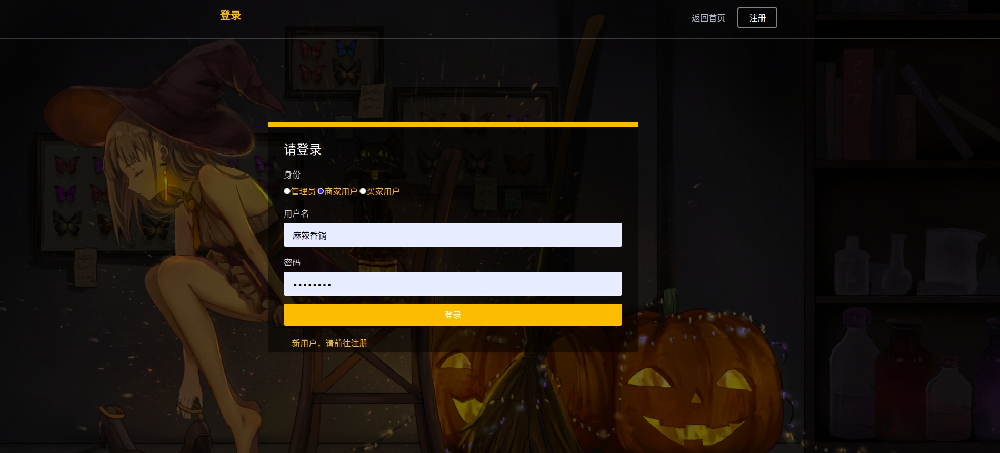
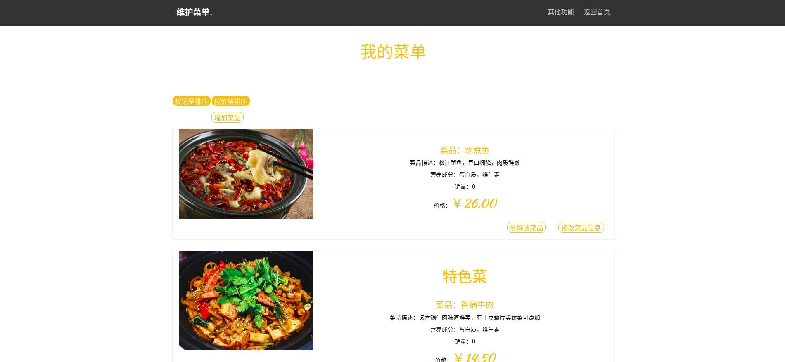
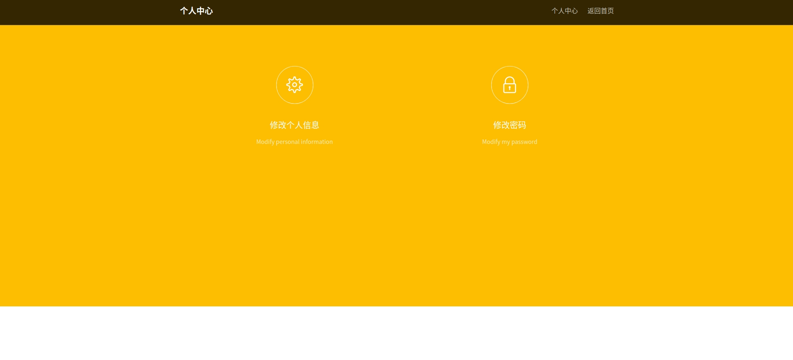
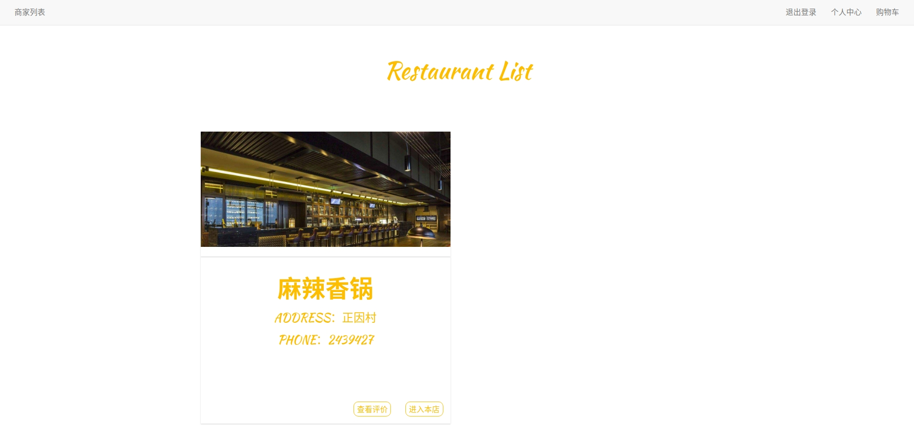
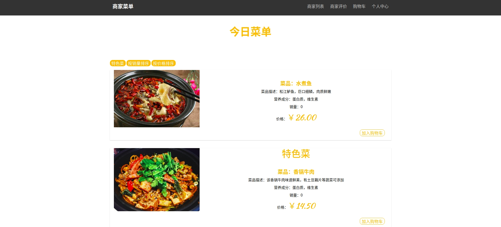
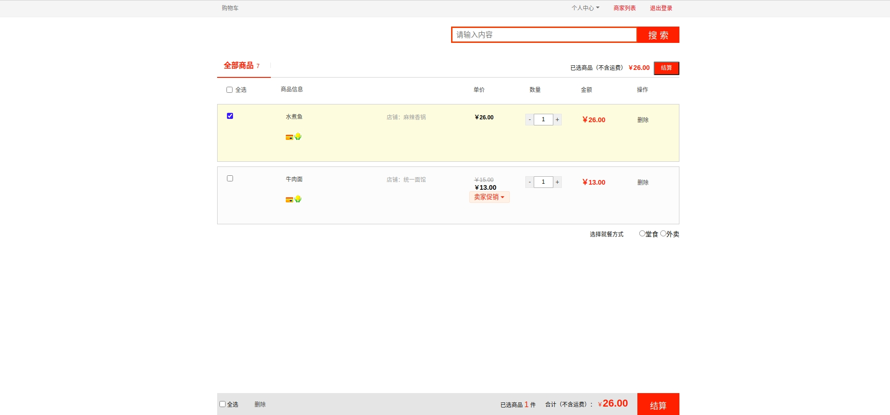
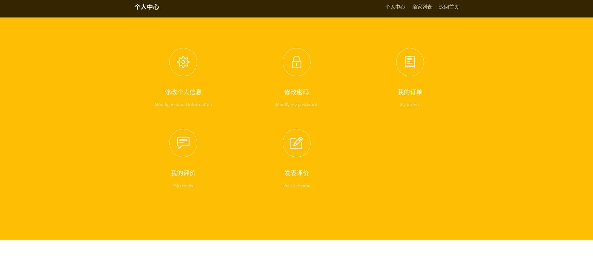
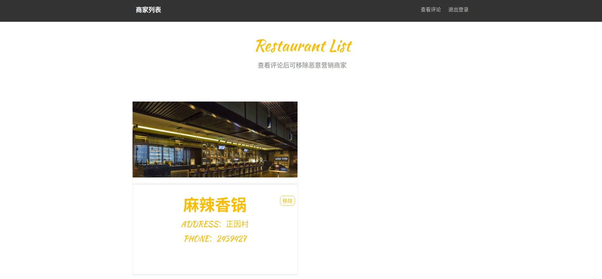

<!--
 * @Descripttion: 
 * @Version: 1.0
 * @Author: ZhangHongYu
 * @Date: 2020-11-02 10:47:01
 * @LastEditors: ZhangHongYu
 * @LastEditTime: 2020-11-07 20:15:40
-->
# Takeaways-Order-Sys

> 本项目为SWPU数据库原理及应用大作业，在线外卖订餐系统《西柚の外卖屋》， 基于[Flask](https://github.com/pallets/flask)框架+MySQL数据库开发，轻量简洁。

#### 项目模块及功能介绍

本系统包括登录模块、注册模块、商家用户模块、买家用户模块、系统管理员模块。具体功能介绍如下:  

+ 登录模块  
- [x] 选择管理员、商家用户、用户三种身份登录
- [x] 将输入的用户名与密码与数据库中的数据进行对比验证

+ 注册模块 
- [x] 选择商家用户、用户两种身份注册
- [x] 将注册信息(用户名、密码、电话、地址)存入数据库

+ 商家用户模块 
- [x] 维护商家个人信息(店名、地址、联系电话、商家图片)
- [x] 修改商家个人登录密码
- [x] 维护菜单列表（菜品名称、菜品描述、营养成分、销量、价格、菜品图片、是否为招牌菜），包括添加、删除、修改
- [x] 对菜品列表按照销量或价格排序查看
- [x] 查看顾客订单与完成情况
- [x] 对顾客订单按照时间或价格排序查看
- [x] 查看顾客对商家当前菜品的评论(订单号、顾客用户名、餐厅名、是否完成、花费、评分、评语、交易时间)

+  买家用户模块 
- [x] 维护买家用户个人信息(用户名、地址、联系电话)
- [x] 修改用户个人登录密码
- [x] 查看商家列表（店名、地址、联系电话、商家图片）
- [x] 查看商家菜单列表（菜品名称、菜品描述、营养成分、销量、价格、菜品图片、是否为招牌菜）
- [x] 对菜单列表按销量或价格排序查看
- [x] 筛选出菜单列表中的特色菜
- [x] 将菜品加入购物车
- [x] 维护购物车，包括选择、删除、搜索、修改数量
- [x] 对购物车进行结算，结算时商品价格可促销打折，可选择堂食或外卖两种就餐方式
- [x] 查看商家评价信息
- [x] 查看以完成订单
- [x] 对当前订单按时间或价格排序查看
- [x] 查看已发表评价(订单号、顾客用户名、餐厅名、是否完成、花费、评分、评语、交易时间)
- [x] 查看可发表评价的订单
- [x] 对可发表评价的订单按交易时间或价格排序查看

+ 系统管理员模块
- [x] 查看各商家获得的评价信息
- [x] 对各商家获得的评价信息按照评分升序查看
- [x] 移除恶意营销商家

#### 项目结构
├── screen_shot&emsp;&emsp;&emsp;&emsp;&emsp;&emsp;&emsp;&emsp;&emsp;&emsp;//项目测试截图     
├── static&emsp;&emsp;&emsp;&emsp;&emsp;&emsp;&emsp;&emsp;&emsp;&emsp;&emsp;&emsp;&emsp;//网页静态资源    
│   ├── css&emsp;&emsp;&emsp;&emsp;&emsp;&emsp;&emsp;&emsp;&emsp;&emsp;&emsp;&emsp;&emsp;//css样式配置   
│   ├── fonts&emsp;&emsp;&emsp;&emsp;&emsp;&emsp;&emsp;&emsp;&emsp;&emsp;&emsp;&emsp;//字体配置    
│   ├── images&emsp;&emsp;&emsp;&emsp;&emsp;&emsp;&emsp;&emsp;&emsp;&emsp;&emsp;//图片文件    
│   ├── js&emsp;&emsp;&emsp;&emsp;&emsp;&emsp;&emsp;&emsp;&emsp;&emsp;&emsp;&emsp;&emsp;&emsp;//javascript脚本文件    
├── templates&emsp;&emsp;&emsp;&emsp;&emsp;&emsp;&emsp;&emsp;&emsp;&emsp;&emsp;//基于jinja2编写的HTML模板文件    
├── app.py&emsp;&emsp;&emsp;&emsp;&emsp;&emsp;&emsp;&emsp;&emsp;&emsp;&emsp;&emsp;&emsp;//Web服务启动程序    
└── README.md&emsp;&emsp;&emsp;&emsp;&emsp;&emsp;&emsp;&emsp;&emsp;&emsp;&emsp;//help    

#### 环境依赖

+ Python 3.6.9
+ Flask 1.1.2
+ MySQL 5.7.2

#### 运行方法
先执行SQL脚本初始化数据库与数据表项
~~~shell
mysql -uroot -p  < init.sql
~~~
再执行Web服务启动程序
~~~python

python app.py
~~~

#### 系统部分界面展示

+ 首页  
  
      

+ 注册界面 

   

+ 登录界面 

   

+ 商家主界面

   

+ 商家菜单界面

   

+ 商家添加菜品界面

   

+ 商家修改菜品界面

   

+ 商家个人中心

   

+ 商家个人信息修改界面

   

+ 商家密码修改界面

   

+ 买家主界面

   

+ 买家菜单界面

   

+ 买家购物车界面

   

+ 买家个人中心

   

+ 买家个人信息修改界面

   

+ 买家密码修改界面

   

+ 管理员主界面

   
